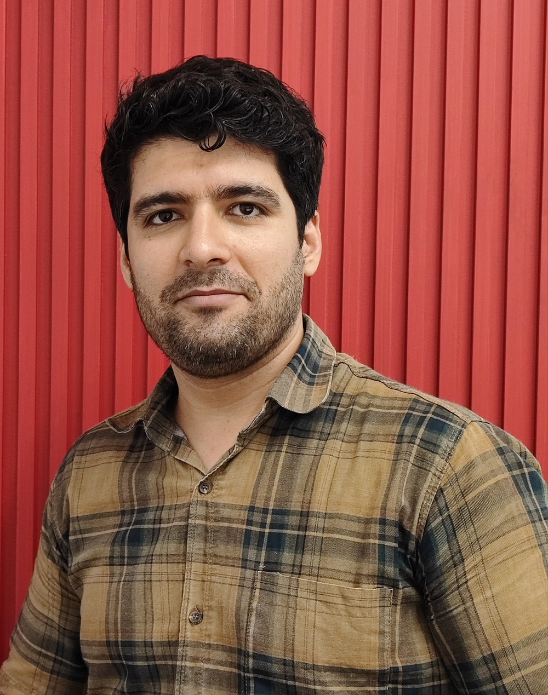

  
  
I'm a quantitative research analyst in the research and development department at <a href="https://www.zarrinroya.com/en/">Zarrin Roya</a> where my research focuses on applying statistics to translate consumers' opinions into business insight. The project I am currently working on includes developing sentiment analysis models for pieces of text in multiple languages.   

I received my master's degree in statistics in Nov 2016 from the statistics department of Shahid Beheshti University. My research focus was Statistical Machine Learning and High-Dimensional data problems.   

My research interests are Statistical Machine Learning, High-Dimensional Statistics, Bayesian Statistics, and Natural Language Processing.

You can download my CV [here](assets/alirezaghorbanicv.pdf).
    
<a id="cy-effective-orcid-url" class="underline"  href="https://orcid.org/0009-0002-8037-7977" target="orcid.widget"  rel="me noopener noreferrer" style="vertical-align: top">
  
    https://orcid.org/0009-0002-8037-7977
</a>
